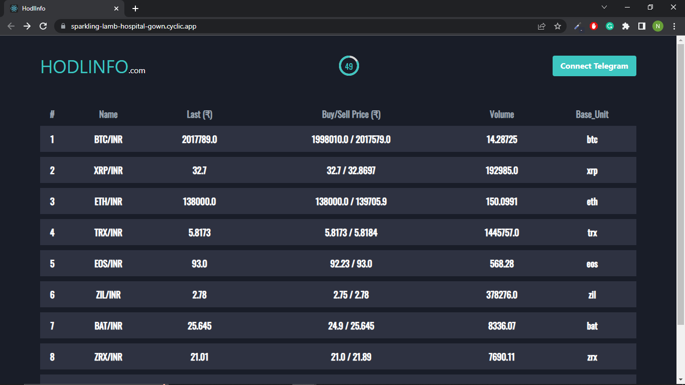
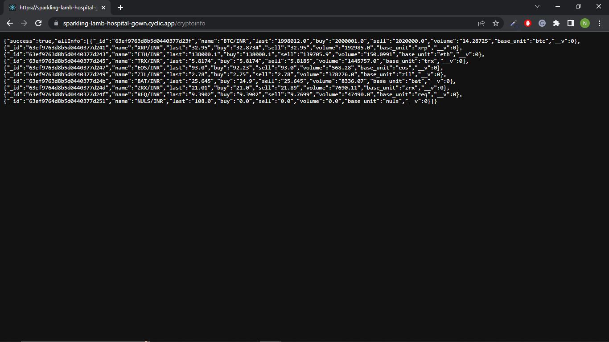

# Crypto Coins Information

Get realtime information of top 10 crypto coins (refreshes after every 60 seconds).

API used: https://api.wazirx.com/api/v2/tickers

Replica of https://hodlinfo.com/

### Tech Stack Used:
Frontend: React JS, Tailwind CSS

Backend: Node JS, Express JS

Database: MongoDB

Deployed Link: [Home](https://sparkling-lamb-hospital-gown.cyclic.app/)

End point to get top 10 crypto information: [Top 10 cryto coins data](https://sparkling-lamb-hospital-gown.cyclic.app/cryptoinfo)

# Outputs

## Home Page

## Data

Made with ❤️ by Nisarg Shah